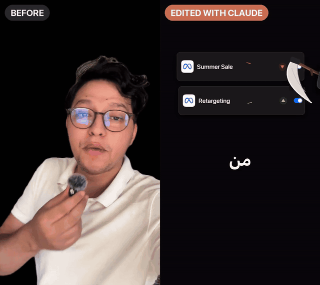

# mehdiagent — edit your reels with Claude Code

Send Claude a talking-head video. Get back a finished 9:16 reel with animated graphics, captions
(any language, including Arabic/Darija right-to-left), sound design, and your background removed.

You don't edit anything yourself: you answer a few questions once, then you just send videos.

<p align="center">
  
  <br>
  <a href="docs/before-after.mp4"><b>▶ Watch the full before / after (35 s, with sound)</b></a>
</p>

Made by **Mehdi** — follow for more Claude workflows:
[Instagram](https://www.instagram.com/mehdiagent.ai/) ·
[TikTok](https://www.tiktok.com/@mehdiagent) ·
[YouTube](https://www.youtube.com/@MehdiAgent_ai) ·
[LinkedIn](https://www.linkedin.com/in/mehdi-zabane)

---

## Two styles

| **Dark** | **White** |
|---|---|
| Near-black Apple dark mode. Real app screens rebuilt from scratch (Ads Manager, Instagram, Claude, …), a physical hook (a scythe cutting your losing campaigns, a tile shooting another), cinematic captions, you cut out of your room. | Clean white "pop-out" look. Animated motion-graphics cards (graphs, terminals, counters, logos), one-word karaoke captions, you in a floating rounded frame with your head popping out. Optional AI B-roll. |
| macOS, Windows, Linux (exact Apple look on Mac) | macOS, Windows, Linux |

You pick a default during setup (or "ask me every time"), and you can switch per video: *"make this one white"*.

---

## Install (5 minutes, once)

New to the terminal? Follow the **[step-by-step guide for beginners](docs/INSTALL.md)** (Mac and Windows).

**You need:** [Claude Code](https://claude.com/claude-code), Python 3, and ffmpeg (Node.js too for the white style).
On Windows, use **WSL** (Ubuntu from the Microsoft Store) and run the commands there. The installer checks everything and asks before installing anything.

```bash
git clone https://github.com/mehdiagentai/mehdiagent_Claude_editing.git
```

```bash
cd mehdiagent_Claude_editing && ./install.sh
```

During install you can also add two great free skills, installed from their official repos:
**[ui-ux-pro-max](https://github.com/nextlevelbuilder/ui-ux-pro-max-skill)** (design intelligence) and
**[caveman](https://github.com/JuliusBrussee/caveman)** (shorter, cheaper Claude answers).

## First run

Open Claude Code anywhere and type:

```
/mehdiagent
```

It asks you, once:

1. **Dark or white** style (or ask every time)
2. **Your language** — English, Arabic/Darija, French, …
3. **How captions are written** — e.g. Darija in Arabic script, English tech words kept as-is, read right-to-left
4. **Transcription service** — **Fish Audio** or **Gemini 2.5 via OpenRouter** (best for Darija and mixed languages)
5. **Do you cut your video yourself?** — yes (it just edits) / no (it picks the best takes and removes silences)
6. **Remove your background?** — recommended
7. **Music** — none, or your own track (nothing is bundled, for copyright reasons)
8. **B-roll** — none, AI B-roll with Higgsfield, or your own clips
9. Your name/handle, your usual comment keyword (e.g. *GUIDE*), the tool you talk about, a demo brand name

Then it opens a small file on your computer where you paste your API key. **Never paste a key into the chat.**

| Service | Get a key | Cost |
|---|---|---|
| Fish Audio | fish.audio → API keys | pay-as-you-go, cents per reel |
| OpenRouter (Gemini 2.5) | openrouter.ai/keys | pay-as-you-go, cents per reel |

## Make a reel

In Claude Code:

```
Make a reel from ~/Downloads/my-video.mp4
```

That's it. Claude transcribes, writes the captions, builds every scene, renders, checks the result frame by
frame (no clipped words, nothing hidden under Instagram's buttons, no leftover background), and sends you the MP4.
It flags any caption word it wasn't sure about so you can correct it.

Change something: *"move the hook graphic earlier"*, *"make the CTA full screen"*, *"change my style to white"*,
*"use this music: ~/Music/track.mp3"*.

## Troubleshooting

```bash
python3 ~/.claude/skills/mehdiagent/scripts/doctor.py
```

It lists anything missing with the exact command to fix it. Or just tell Claude *"doctor"*.

## Update / uninstall

```bash
cd mehdiagent_Claude_editing && git pull && ./install.sh
```

```bash
./uninstall.sh
```

`uninstall.sh` keeps your settings and keys; add `--purge` to delete them too.

## Privacy

Your settings and API keys stay on your computer in `~/.mehdiagent/` (the key file is readable only by you) and are
never uploaded by these skills. Your audio goes to the transcription service you chose (Fish Audio or OpenRouter).
Like any Claude Code session, your requests — and the frames Claude looks at to check your reel — are processed by
Anthropic under your Claude plan's terms. Rendering and background removal run locally on your computer.

## What's inside

```
skills/
  mehdiagent/   setup wizard, settings, transcription (Fish / Gemini via OpenRouter), word aligner, doctor
  reel-dark/    the dark style: scene library, renderer, background cut-out, captions, sound kit, quality gates
  reel-white/   the white style: HTML/GSAP card generator, karaoke captions, compositing, B-roll recipes
install.sh  uninstall.sh  CREDITS.md  LICENSE
```

## Credits

Code: MIT (see `LICENSE`). Third-party pieces keep their own licenses — see [`CREDITS.md`](CREDITS.md). Note: the
word-alignment model Claude downloads on first use (Meta MMS) is **non-commercial (CC-BY-NC 4.0)**.
